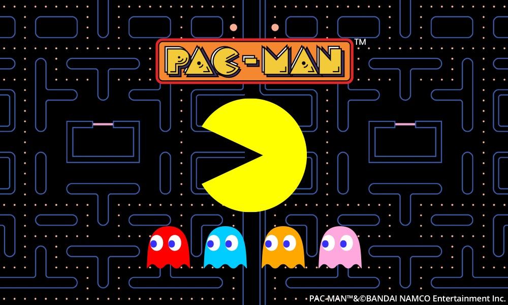
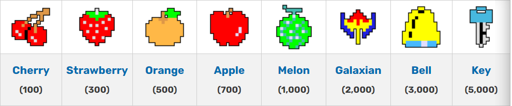
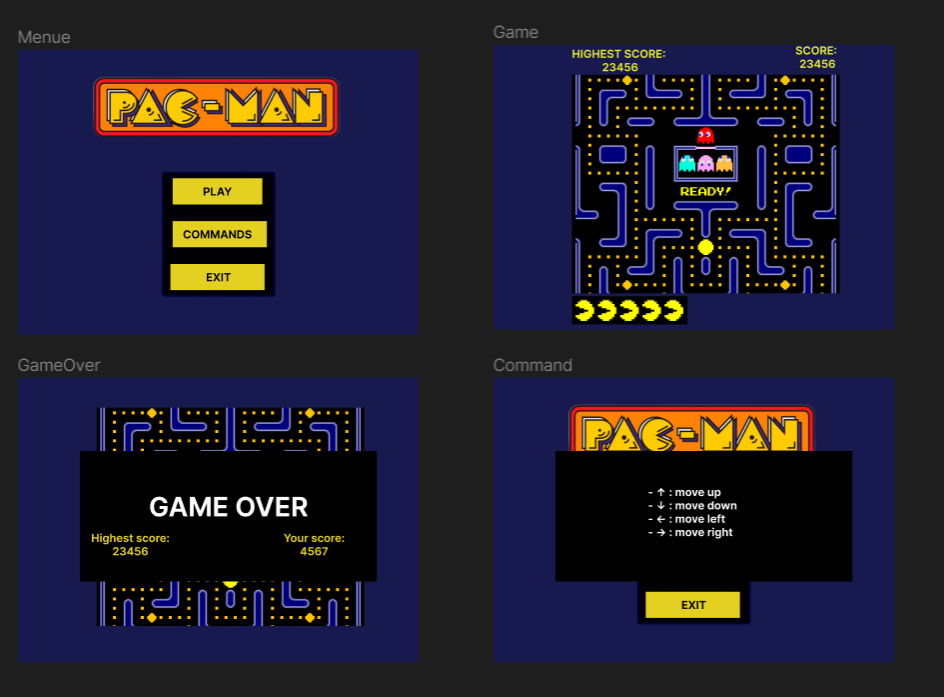

# Functional Specification

📖 Table of content

- [Functional Specification](#functional-specification)
  - [Team members](#team-members)
  - [Project overview](#project-overview)
  - [project goal](#project-goal)
  - [Game's rules](#games-rules)
    - [Win condition](#win-condition)
    - [Loose condition](#loose-condition)
    - [Game board](#game-board)
    - [Character](#character)
      - [Player](#player)
      - [Ghosts](#ghosts)
    - [Item](#item)
      - [Fruits](#fruits)
      - [Power-up](#power-up)
  - [Out of scope](#out-of-scope)
  - [PEGI \& Copyright Information](#pegi--copyright-information)
    - [PEGI Rating](#pegi-rating)
    - [Copyright](#copyright)
  - [Audience and persona](#audience-and-persona)
    - [Target Audience](#target-audience)
    - [Player Personas](#player-personas)
      - [Persona 1: Timmy the Young Gamer](#persona-1-timmy-the-young-gamer)
      - [Persona 2: Sarah the Casual Gamer](#persona-2-sarah-the-casual-gamer)
      - [Persona 3: Retro Gaming Enthusiast](#persona-3-retro-gaming-enthusiast)
      - [Key Considerations](#key-considerations)
  - [Game's features](#games-features)
  - [Non-functional requirements](#non-functional-requirements)
  - [Game behaviors](#game-behaviors)
    - [Ghosts behavior](#ghosts-behavior)
    - [Items behavior](#items-behavior)
    - [Score/High score](#scorehigh-score)
    - [New life](#new-life)
  - [Game balancing](#game-balancing)
  - [Mock up](#mock-up)
  - [Risks and assumptions](#risks-and-assumptions)
  - [Milestones](#milestones)
  - [Glossary](#glossary)
  

## Team members
| Name               | Role                     | Email                          | GitHub                              |
|--------------------|--------------------------|--------------------------------|-------------------------------------|
| Guillaume Deramchi | Project Manager          | guillaume.deramchi@aglosup.com | https://github.com/Guillaume18100   |
| Lucas Megnan       | Program Manager          | lucas.megnan@algosup.com       | https://github.com/LucasMegnan      |
| Laura-Lee Hollande | Technical Lead           | laura-lee.hollande@algosup.com | https://github.com/lauraleehollande |
| Mathis Lebel       | Junior Software Engineer | mathis.lebel@algosup.com       | https://github.com/mathislebel      |
| Loris DeMattia     | Junior Software Engineer | loris.demattia@algosup.com     | https://github.com/Loriisss         |
| Wilfried Portet    | Quality Assurance        | wilfried.portet@algosup.com    | https://github.com/wilfried973      |

## Project overview

We were asked to recreate the classic Pac-Man in assembly x86 on DOSBox emulator as simple as posssible while
improving the basic gameplay, randomness, score management, high scores, sounds and musics.

As a reminder Pac-man is a video game made by Toru Iwatani for the enterprise Namco. It was released on May 22, 1980. The game consists to eat all the dots with Pac-man while avoiding four colored ghosts.

<!-- /insérer image du jeu/ -->

## Project goal

- Project duration: 7 weeks
- Technology: assembly
- Platform: DOSBox emulator, which is playable on computers

## Game's rules

### Win condition

The player win a level when he eats all dots in the map without losing all is lives.

### Loss condition

When the player lost all of is lives, he loses.
To lose a life, the player needs to be touched by a ghost.

### Game board

The game board is a square with maze. The walls aren't traversable. We add pipes at each side of the map.
These pipes can teleport the player on the other side of the map.

We use the same graphical charter of the original Board game of Pac-Man but we custom the design of the map.

<!-- /ajouter imager du jeu classic et la version google/ -->

### Characters

#### Player

The player control Pac-Man and his objectives are to have the maximum score value and not be touched by any ghost. He can take power-ups and fruits to have more points and bonus to kill the ghosts.
The player can eat fruits and it will give points, and when he eats a power up he can eat the ghosts and he's faster.

<!-- /insérer une image de Pac-Man/ -->

#### Ghosts

Ghosts are the enemies of the player and their objective is to kill the player. They have a random pattern to search and kill the player.  
Behavior of the different ghosts:

- Red: Chases Pac-Man all the time, Also speeds up after you've eaten a certain amount of dots, which gets less for each level.

- Pink: Fast but random movement

- Cyan: Shy and tries to stay away from pac-man, unless approached too much, after which it will chase Pac-Man too.

- Orange: Slow and Random Movement.  

When the player eats a power-up, the ghosts are scared and fleeing Pac-Man.

<!-- /insérer une image des 4 fantômes (voir wikipédia pour info sur le fonctionnement des fantômes)/ -->

### Items

#### Fruits

There are different fruits which give different amounts of points depending on the level.

The first fruit is a cherry and it can give 100 points. The second is a strawberry and it gives 300 points. After, we have the orange with 500 points, the apple with 700 points, the melon with 1000 points, the Galaxian with 2000 points, the bell with 3000 points, and finally, there is the key that gives 5000 points.

#### Power-ups

When the player eats a power-up, the ghosts are scared and flee the player. The player has extra speed and can eat ghosts. When he eats a ghost, he wins 100 points.
There is only 4 power-ups per level splited in the board.

<!-- /image power-up/ -->

## Out of scope

The first idea was to create a new design for Pac-Man inspired by Japanese culture, but after brainstorming, we decided to reject this idea, because it was out of reach to code it in Assembly.

For the second idea, we wanted to play Pac-Man in first-person, but we thought it was irrelevant and out of reach to code it in Assembly.

## PEGI & Copyright Information

### PEGI Rating

- PEGI 3 (Suitable for all ages)

### Copyright

Our game is a tribute to the famous game Pac-Man developed by Bandai Namco Entertainment Inc. As a reminder, Pac-Man® is a registered trademark of Bandai Namco Entertainment Inc. Therefore, this game will be inspired by Pac-Man and will not be affiliated with or endorsed by Bandai Namco Entertainment Inc. or any related entities.

## Audience and persona

### Target Audience

The game is designed to target a broad and diverse audience, aiming for a PEGI 3 rating, which means it's suitable for players of all ages. The primary focus is on casual gamers who enjoy classic arcade-style games. By keeping the content and gameplay accessible to all age groups, we aim to make the game an inclusive experience that can be enjoyed by children, teenagers, and adults alike.

### Player Personas

#### Persona 1: Timmy the Young Gamer

- **Age:** 12 years old
- **Background:** Timmy is a middle school student who loves video games. He is new to gaming and enjoys playing simple and colorful games. He often plays games with his parents or older siblings.
- **Gaming Experience:** Limited gaming experience. Mostly plays mobile games.
- **Motivations:** Timmy is looking for fun and engaging games to play after school. He wants something that is easy to understand and not too challenging.

#### Persona 2: Sarah the Casual Gamer

- **Age:** 32 years old
- **Background:** Sarah is a working mother with two children. She enjoys playing games in her free time to relax and have fun. She used to play classic arcade games like Pac-Man in her childhood.
- **Gaming Experience:** Casual gamer. Has played games on mobile devices and web browsers.
- **Motivations:** Sarah is looking for games that provide a sense of nostalgia while being easy to pick up and play during her breaks. She wants a game that can be enjoyed by her and her kids.

#### Persona 3: Retro Gaming Enthusiast

- **Age:** 45 years old
- **Background:** John is a software engineer and a passionate retro gaming enthusiast. He collects classic arcade cabinets and enjoys playing old-school games on emulators.
- **Gaming Experience:** Experienced gamer with a deep understanding of classic arcade games.
- **Motivations:** John is interested in the technical aspects of game development, including programming in assembly language. He's excited about the opportunity to study and understand the game's code, gameplay mechanics, and design

#### Key Considerations

- The game's user interface and controls should be simple and intuitive to cater to players of all ages and experience levels.
- The game should provide an option for local multiplayer or co-op gameplay, allowing parents and children to enjoy the game together.
- Art and sound design should strike a balance between modern aesthetics and retro charm to appeal to both newcomers and retro gaming enthusiasts.

## Game's features

**Game Concept and Mechanics:**

- Classic maze-based gameplay with Pac-Man and ghosts
- Player-controlled Pac-Man character
- Each ghost move according to an algorithm detailled in the [Ghosts behavior](#ghosts-behavior) section
- Collectible pellets for points
- Power pellets to make ghosts vulnerable
- Fruit bonus items for extra points

**Player Controls:**

- Keyboard input for Pac-Man movement
  - ↑ : move up
  - ↓ : move down
  - ← : move left
  - → : move right
- Responsive and smooth character movement
  - response time: ≤200 milliseconds

**Maze Design:**

- Custom maze layouts with walls and corridors
- Multiple levels with increasing difficulty
- Warp tunnels for Pac-Man and ghosts

**Graphic and Display:**

- 2D top-down view of the maze
- Character animations (Pac-Man, ghosts, and fruit)
- Score display and UI elements

**Game Logic:**

- Score calculation and tracking
- Lives system with extra lives at certain score thresholds
- Game over conditions
  - the player loose all his lives
- Victory conditions
  - the player collect all the pellets without loose all his life
- Current and high score display
- Game balancing

**Gameplay Features:**

- Ghost house where ghosts respawn
- Speed-up feature for Pac-Man
- Different ghost personalities for variety
  - **Green ghost:** always follows directly behind Pac-Man, except if the short-sighted decision-making causes him to take an inefficient path
  <!-- Blinky -->
  - **Orange ghost:** embushed the player by looking at his current position and orientation and selecting the location four tiles straight ahead him
  <!-- Pinky -->
  - **Yellow ghost:** exhibits unpredictable movements by alternating between direct pursuit of the player and erratic lateral shifts, influenced by a complex blend of Blinky's position and a set point calculated using a specific algorithm
  <!-- Inky -->
  - **Purple ghost:** exhibits erratic behavior by alternating between chasing Pac-Man and moving to a random location when he's too close to the player
  <!-- Clyde -->

**Collision Detection:**

- Player and ghosts can't pass throuhg the walls
- Collision between the player and one of the ghost
  - the ghost is killed and respawn in the ghost house
- Collision between one of the ghost and the player
  - the player loose 1 life

**Audio:**

- PC speaker or sound card support for simple game sounds
- Sound effects for eating pellets, ghosts, and collecting fruit
- Background music

**UX and user friendly requirements:**

- All the transitions have to be fluid
  - ≤200 milliseconds
- Pause game
- Display all the commands

**Emulator Compatibility:**

- Ensure compatibility with DOSBox
<!-- Ability to run on older DOS systems -->
- Proper setup instructions for DOSBox

**Documentation:**

- [Game manual](https://github.com/algosup/2023-2024-project-2-x86-retrogaming-team-5/blob/main/README.md) with game instructions

**Legal Considerations:**

- Ensure proper licensing and copyrights for any Pac-Man related assets or gameplay elements.

<!-- ### Pac-Man features

The movements of Pac-Man are simple, he can go left, right, top and bottom. We can control it with arrows of the keyboard. -->

<!-- ### Ghosts features -->

<!-- ### Collision

The ghosts and the player can't pass throught wallsand. When a ghost touch Pac-Man The game is over but if Pac-Man had a power-up the ghost was dead and he goes back in the ghost room. -->

<!-- ### Score

We added a score system to watch your score and another, if you want watch the best score on the computer.
When you have 10.000 score the game give 1 additional life.

you win Score when you eat dots, fruits and ghosts when you have the power-up activate. -->

<!-- ### Screen game over

When you have no life and a ghost touch you a last time the screen game over appear.
We can see two button, play again and exit. -->

<!-- ### Musics/Sounds effects

We decided to use 3 musics, the first for the lobby, anoter when you play and a last when you eat a power up to change the atmosphere of the game. -->

<!-- #### ON/OFF

We wanted to add a feature to cut the sounds of the game because if you play a long moments the same music endlessly cand be irritate. -->

## Non-functional requirements

## Game behaviors

### Ghosts behavior

- The patterns are different for all ghosts some are more agressive and others are more passive.
- The ghosts leave the room ghosts at different times.
- When the player eat a PowerUp ghosts flees Pac-Man and the patterns are random for all ghosts.
- useful link:  https://gameinternals.com/understanding-pac-man-ghost-behavior

### Items behavior

- The fruits spwans randomly during the level with a interval time of 20 secondes.
- To spawn certain fruit we need to complete different level of the game.
- The PowerUp are only four per level and situate on each corner of the map. When you finish a level all PowerUp respawn.

### Score/High score

- When you have the new high score it will be displayed at the end of the game as a high score.

### New life

- We start the game with 3 lives and the maximum lives you can have is 5.
- To receive a bonus life you need to have 10,000 scores. Every 10,000 score you receive 1 life.

<!-- ## Collision

The ghosts and the player can't pass throught wallsand when a ghost touch Pac-Man The game is over but if Pac-Man had a power-up the ghost is dead and go back in the ghost room.

/gif pacman mur, pacman meurt fantôme, pacman mange fantôme/ -->

## Game balancing

- **Pellet**: 10 points
- **Power Pellet**: 50 points
- **Eating Ghosts**: 200, 400, 800, 1600 points (eat ghosts consecutively for increasing points)
- **Fruits**: Varying points

## Mock up

## Risks and assumptions

## Milestones

| Date  | Hours   | Deliverable              |
|-------|---------|--------------------------|
| 13/11 | 1.30 PM | Functional specification |
| 27/11 | 1.30 PM | Technical specification  |
| 8/12  | 5 PM    | Test plan                |
| 11/12 | 5 PM    | Working prototype        |
| 21/12 | 5 PM    | Final product            |

## Glossary

Assembly: In computer programming, assembly language, often referred to simply as assembly and commonly abbreviated as ASM or asm, is any low-level programming language with a very strong correspondence between the instructions in the language and the architecture's machine code instructions.

PEGI: PEGI, short for Pan-European Game Information, is a European video game content rating system established to help European consumers make informed decisions when buying video games or apps through the use of age recommendations and content descriptors.

Copyright: A copyright is a type of intellectual property that gives its owner the exclusive right to copy, distribute, adapt, display, and perform a creative work, usually for a limited time.

Ghost room: The ghost room is the area where they appear at the start of the game and when they are dead.

DosBox: DOSBox is an emulator simulating an MS-DOS compatible environment with the aim of running video games formerly developed for this system. DOSBox is free software and available on many operating systems, such as Linux, FreeBSD, Android, MS Windows, Mac OS X and BeOS.
