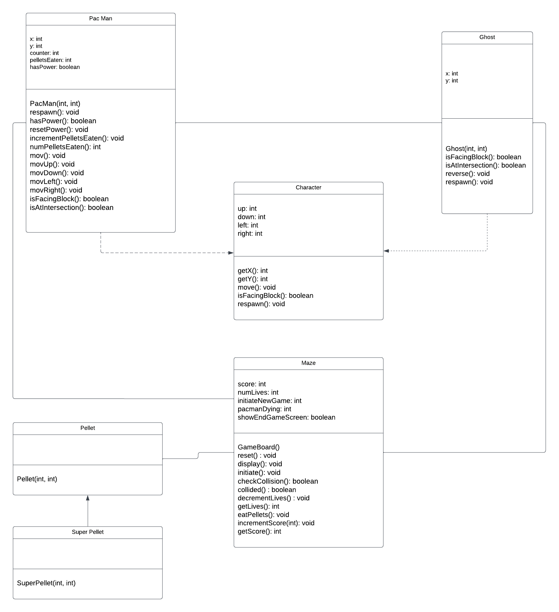

# Technical Specification

<details>

<summary>
📖 Table of content
</summary>

- [Technical Specification](#technical-specification)
  - [Introduction](#introduction)
    - [Overview](#overview)
      - [Document Purpose](#document-purpose)
      - [Project Overview](#project-overview)
      - [Context](#context)
      - [Suggested Solution](#suggested-solution)
      - [Stakeholders](#stakeholders)
    - [Glossary](#glossary)
    - [Technical Requirements](#technical-requirements)
    - [Out of Scope](#out-of-scope)
    - [Future Goals](#future-goals)
      - [Technical Enhancements](#technical-enhancements)
      - [Technological Advancements](#technological-advancements)
  - [Assumptions](#assumptions)
  - [Solution](#solution)
    - [Propopsed Solution](#propopsed-solution)
      - [External Components and Interactions](#external-components-and-interactions)
      - [Dependencies](#dependencies)
      - [Pros and Cons](#pros-and-cons)
    - [Development Environment](#development-environment)
      - [Language - Assembly](#language---assembly)
      - [Assembler - NASM](#assembler---nasm)
      - [Emulator - DOSBox](#emulator---dosbox)
      - [Integrated Development Environment](#integrated-development-environment)
      - [version control - Git](#version-control---git)
      - [GitHub Integration](#github-integration)
    - [System Requirements](#system-requirements)
      - [Hardware Requirements](#hardware-requirements)
      - [Software Requirements](#software-requirements)
      - [Compatibility](#compatibility)
    - [Code Organization](#code-organization)
      - [Directory Structure](#directory-structure)
      - [Source Code](#source-code)
    - [Game Architecture](#game-architecture)
      - [Main Game Loop](#main-game-loop)
    - [Design](#design)
      - [User Interface (UI)](#user-interface-ui)
      - [Graphics and Animation](#graphics-and-animation)
        - [Sprites](#sprites)
        - [Pac-Man® Sprite](#pac-man-sprite)
        - [Ghost Sprites](#ghost-sprites)
        - [Pellet and Power Pellet Sprites](#pellet-and-power-pellet-sprites)
        - [Fruit Sprites](#fruit-sprites)
        - [Maze Walls and Pipes](#maze-walls-and-pipes)
        - [Ghost House Door](#ghost-house-door)
        - [Animation Frame Rate](#animation-frame-rate)
      - [Audio Design](#audio-design)
      - [Design Review](#design-review)
    - [Game Dynamics](#game-dynamics)
    - [Game Mechanics](#game-mechanics)
      - [Maze](#maze)
      - [Player Movement](#player-movement)
      - [Ghosts Behavior](#ghosts-behavior)
      - [Items Implementation](#items-implementation)
      - [Scoring System](#scoring-system)
        - [Game Balencing](#game-balencing)
      - [Collision Handling](#collision-handling)
        - [Ghost Collision](#ghost-collision)
        - [Object Collisions](#object-collisions)
        - [Wall and Pipe Collisions](#wall-and-pipe-collisions)
        - [Exceptions](#exceptions)
      - [Level Progression](#level-progression)
      - [Game Over](#game-over)
      - [Pseudo Code](#pseudo-code)
    - [Integration with DOSBox](#integration-with-dosbox)
    - [Performance Optimization](#performance-optimization)
  - [Testing](#testing)
  - [Release](#release)
    - [Deployment Architecture](#deployment-architecture)
    - [Deployment Environments](#deployment-environments)
    - [Phased Roll-out Plan](#phased-roll-out-plan)
      - [Testers Selection for Phased Roll-out](#testers-selection-for-phased-roll-out)
      - [Continuous Feedback Loop](#continuous-feedback-loop)
    - [Plan for Communicating Changes](#plan-for-communicating-changes)
    - [GitHub Release Management](#github-release-management)
  - [Documentation](#documentation)
  - [Legal Considerations](#legal-considerations)
  - [Milestones](#milestones)
  
</details>

| Title       | Technical Specification For Pac-Man® Game                                                                     |
|-------------|--------------------------------------------------------------------------------------------------------------|
| Author(s)   | Laura-Lee Hollande                                                                                           |
| Team        | Team 5 - Laura-Lee Hollande, Guillaume Deramchi, Lucas Megnan, Mathis Lebel, Loris DeMattia, Wilfried Portet |
| Reviewer(s) | ALGOSUP                                                                                                      |
| Created on  | 11/15/23                                                                                                     |

## Introduction

### Overview

This document is based on the [functional specification](https://github.com/algosup/2023-2024-project-2-x86-retrogaming-team-5/blob/main/Documents/Functional.md). This document should be read before this one to ensure a better understanding of the project's functional requirements.

#### Document Purpose

The technical specification outlines the implementation details and requirements for the development of the Pac-Man® game. This document is intended for the development team and provides a detailed breakdown of the technical aspects involved in creating the game.

#### Project Overview

The Pac-Man® Game project aims to recreate the classic Pac-Man® experience in assembly x86 on the DOSBox emulator. The primary objective is to provide users with an enhanced and nostalgic gaming experience, staying true to the iconic gameplay of the original Pac-Man® released in 1980. Players will navigate Pac-Man® through a maze, consuming pellets, avoiding ghosts, and achieving high scores. The challenge lies in implementing the game's mechanics in assembly language, optimizing performance for the DOSBox environment, and incorporating additional features while maintaining the essence of the beloved arcade classic.

#### Context

This project is an educational project for the purpose of learning assembly and mastering this language. The choice of this language adds a technical challenge but also a good practice to understand the following concept:

- Perforcmance optimization
- Learning computer architecture
- Debbuging skills
- Improving coding skills

#### Suggested Solution

It involves meticulous implementation of Pac-Man®'s gameplay mechanics using assembly x86, ensuring compatibility with the DOSBox emulator. The team aims to enhance the classic experience by introducing randomness, improving score management, and incorporating sound and music elements. The visual identity will adopt a pixel art style with a vibrant color scheme, striking a balance between modern aesthetics and retro charm. The proposed solution addresses both the technical intricacies of assembly language and the user's desire for an authentic Pac-Man® experience.

#### Stakeholders

- **Development Team:** Responsible for the coding, testing, and optimization of the game, ensuring it aligns with the assembly x86 and DOSBox requirements.
- **ALGOSUP:** The school who given the project and who will be part of the reviewvers team.
- **ALGOSUP students:** End-users of the game, interested in the technical aspects of game development and seeking for the opportunity to understand how our game work.

### Glossary

### Technical Requirements

**Assembly Coding Standards:**

- **Objective:** adhere to [assembly coding standards](https://projectacrn.github.io/latest/developer-guides/asm_coding_guidelines.html)
- **Details:** follow established coding conventions for assembly x86 programming to ensure consistency, readability, and maintainability of the codebase
- **Dependencies:** team familiarity with assembly coding standards

`The code should also be commented to improve the understanding and the readeability of the code in the future.`
  
**DOSBox Compatibility:**

- **Objective:** ensure compatibility with DOSBox emulator
- **Details:** test the game on DOSBox to verify proper execution and address any compatibility issues. Optimize code for DOS environment limitations
- **Dependencies:** DOSBox emulator, thorough testing on various DOS configurations
  
**Performance Optimization:**

- **Objective:** optimize game performance
- **Details:** identify and address performance bottlenecks, minimize CPU and memory usage, and ensure smooth gameplay on a range of hardware configurations
- **Dependencies:** profiling tools, knowledge of assembly-level performance optimization

**Error Handling:**

- **Objective:** implement robust error handling
- **Details:** develop error handling mechanisms for unexpected scenarios, providing clear and user-friendly error messages. Ensure graceful recovery from errors
- **Dependencies:** understanding of potential issues, proactive testing for error scenarios

**Documentation:**

- **Objective:** provide comprehensive documentation
- **Details:** document the assembly code, system architecture, and any external dependencies. Create user manuals and developer documentation for future reference
- **Dependencies:** documentation tools, attention to detail in documenting code

**Security Considerations:**

- **Objective:** address security concerns
- **Details:** Identify potential security threats, implement mitigation strategies, and ensure the overall security of the game, particularly in user data handling
- **Dependencies:** Knowledge of assembly-level security best practices

**Testing:**

- **Objective:** Conduct thorough testing
- **Details:** Develop and execute unit tests, integration tests, and performance tests to ensure the correctness and reliability of the game
- **Dependencies:** Testing frameworks, test environments

### Out of Scope

**New Design Architecture:**

- **Description:** introduction of a new design architecture not aligned with the classic Pac-Man® style
- **Reasoning:** departing from the original design would require substantial changes in the codebase, surpassing the scope of the project

**First-Person Coding:**

- **Description:** coding the game logic to support first-person perspective interactions
- **Reasoning:** the project focuses on preserving the classic top-down arcade style, making first-person coding unnecessary

### Future Goals

#### Technical Enhancements

**Graphics and Animation Refinement:**

- **Objective:** improve the overall visual experience with enhanced graphics and smoother animations
- **Rationale:** elevate the aesthetic appeal of the game and provide a more engaging user experience

**Accessibility Features:**

- **Objective:** incorporate accessibility features such as colorblind-friendly options and customizable controls
- **Rationale:** ensure inclusivity by accommodating a diverse range of players with different needs

#### Technological Advancements

**Compatibility with Modern Systems:**

- **Objective:** ensure compatibility with modern systems and explore potential ports to contemporary platforms
- **Rationale:** extend the reach of the game to a broader audience and adapt to evolving technology
  
**Cross-Platform Support:**

- **Objective:** investigate the feasibility of cross-platform support, enabling the game to run seamlessly on various operating systems
- **Rationale:** facilitate accessibility for players on different devices and environments

**Integration of New Technologies:**

- **Objective:** explore the integration of modern technologies, such as improved sound libraries and graphics frameworks
- **Rationale:** keep the game technically up-to-date while preserving its classic charm

## Assumptions

The successful execution of the Pac-Man® Game project relies on the following assumptions:

**Team Expertise:**

- **Assumption:** the development team possesses proficient knowledge of assembly language
- **Rationale:** assembly language expertise is crucial for coding the game logic and achieving optimal performance on the chosen platform
  
**DOSBox Stability:**

- **Assumption:** DOSBox provides a stable and consistent emulation environment for MS-DOS compatible systems
- **Rationale:** the project assumes that DOSBox is a reliable emulator for running the Pac-Man® game on modern computers
  
**Player Familiarity:**

- **Assumption:** players are expected to be familiar with basic Pac-Man® mechanics
- **Rationale:** the game design assumes a level of familiarity with classic Pac-Man® gameplay, minimizing the need for extensive tutorials
  
**Testing Resources:**

- **Assumption:** adequate resources will be allocated for comprehensive testing on various systems
- **Rationale:** comprehensive testing is essential to identify and address potential compatibility issues on different hardware configurations

## Solution

### Propopsed Solution

The proposed solution is to recreate the classic Pac-Man® game in assembly x86 to run on the DOSBox emulator. The primary components include the assembly codebase, interaction with the DOSBox environment, and emulation of the original Pac-Man® gameplay.

#### External Components and Interactions

**Assembly Codebase:**

- **Interaction:** The assembly code constitutes the core of the solution, defining Pac-Man®'s behavior, ghost movements, and game mechanics.
- **Alteration:** The assembly code alters the game state based on user input, events, and interactions.

**DOSBox Emulator:**

- **Interaction:** the game will interact with the DOSBox emulator to execute assembly code within a simulated MS-DOS environment
- **Alteration:** DOSBox provides a platform for executing assembly code and emulating the original Pac-Man® environment

#### Dependencies

**DOS Environment:**
The solution is dependent on the DOS environment provided by the DOSBox emulator.

**Assembly Language Tools:**
Development tools for assembly language programming are required for coding and assembling the game.

#### Pros and Cons

**Pros:**

- Recreates the classic Pac-Man® experience.
- Provides a retro gaming experience on modern systems.
- Offers a challenging development project for the team.

**Cons:**

- Assembly language complexity may pose challenges.
- Limited modern features compared to contemporary game development.

### Development Environment

#### Language - Assembly

The Pac-Man® project is developed using assembly language, specifically targeting the x86 architecture. This choice is driven by the need for low-level control and efficiency.

#### Assembler - NASM

The Netwide Assembler (NASM) is the chosen assembler for this project.
It's compatibility with x86 architecture and its efficiency in handling low-level operations make it the ideal choice for translating assembly code into machine code.

- Renowned for its efficiency and flexibility, vital for handling complex programming tasks in game development, such as memory management and hardware interaction
- Serve as the foundation for the entire coding process, encompassing game mechanics implementation, graphics rendering, and user input handling

#### Emulator - DOSBox

DOSBox serves as the emulator for this project, providing a DOS environment on modern operating systems. This emulator is essential to accurately replicate the original game's runtime environment, allowing for comprehensive testing and development.

- Essential for emulating a DOS environment, it enables us to test and run the game in an environment that faithfully replicates the original hardware conditions
- Ensure compatibility with modern operating systems

#### Integrated Development Environment

For coding and source code management, we utilize Visual Studio Code (VSCode). VSCode is a robust text editor that seamlessly integrates with version control systems like Git. Its versatility and extensibility make it an ideal choice for efficient development and collaboration within our team.

**Required extension:**

- [nasm x86 syntax highlighting](https://marketplace.visualstudio.com/items?itemName=LucianIrsigler.nasm): to provide syntax highlighting and snippets for NASM assembly language, enhancing code readability and productivity
- [VSCode DOSBox](https://marketplace.visualstudio.com/items?itemName=xsro.vscode-dosbox): to run DOSBox and its variants in VSCode, supporting platforms such as JSDos, DOSBox, and DOSBox-x, with installation instructions and customizable settings for different operating systems.

#### version control - Git

For effective source code management, Git has been selected, offering key advantages tailored to our collaborative and iterative development approach.

- Facilitates parallel development, supporting structured workflows
- Maintains a detailed history for easy issue identification and code stability
- Integrates seamlessly with GitHub for streamlined collaboration and code reviews
- Assists in identifying and resolving conflicts to ensure smooth code integration

#### GitHub Integration

For streamlined project management and collaborative development, we leverage GitHub.

**Github admin:**

- Guillaume Deramchi
- Laura-Lee Hollande

**Implementation:**

- **Branching Strategy:** employing feature, development, and main branches for a structured workflow
- **Commit Guidelines:** encouraging clear and concise commit messages for improved readability
- **GitHub Hosting:** utilizing GitHub as a hosting platform for our project
- **Issue Tracking:** leveraging GitHub's issue tracking system for efficient bug reporting and task management

**Branch protection rules:**
The main branch is safeguarded. Pushing changes requires the creation of a pull request, with a mandatory review before merging. This ensures a thorough review process, promoting code quality and collaboration.

### System Requirements

The system prerequisites for our Pac-Man® game have been meticulously defined to ensure seamless compatibility and optimal performance throughout the game's development and execution.

#### Hardware Requirements

- **Processor:** should support the x86 architecture, preferably a 16-bit processor to faithfully replicate the original game's environment
- **Memory:** minimum of 512 KB RAM, with a recommended 1 MB or higher for enhanced performance
- **Storage:** at least 10 MB of free disk space is necessary for game installation and saving game data
- **Input Devices:** keyboard integration is essential for gameplay control

#### Software Requirements

- **Operating System:** the DOSBox emulator is a mandatory prerequisite, providing a DOS environment on modern operating systems to accurately emulate the game's intended runtime environment
- **Programming Language:** NASM (Netwide Assembler) is required for Assembly language development, chosen for its direct compatibility with x86 architecture and efficiency in handling low-level operations
- **Development Tools:** a robust text editor (e.g., VSCode) is essential for coding, integrated with version control systems like Git for source code management. Compatibility with debugging tools that support Assembly language, NASM, and DOSBox integration is crucial for efficient development and troubleshooting

#### Compatibility

- **Operating Systems:** compatible with DOS environments provided by DOSBox on macOS and Windows. The game should seamlessly execute on both modern and legacy systems that meet the specified hardware requirements. Emphasis on backward compatibility is crucial to preserve the authenticity of the gameplay experience

- **DOSBox Emulator:** the game is designed to ensure robustness and consistent performance within the DOSBox emulator, which serves as the cornerstone of our development and testing environment. This emphasis is critical for maintaining the stability and playability of the game across various platforms

### Code Organization

#### Directory Structure

```text
/project-root
│
├── src
│   ├── main.asm
│   ├── player.asm
│   ├── ghosts.asm
│   ├── items.asm
│   ├── ui.asm
│   └── ...
│
├── assets
│   ├── images
│   │   ├── pacman_sprite.bmp
│   │   ├── ghost_sprite.bmp
│   │   └── ...
│   └── sounds
│       ├── eat_pellet.wav
│       ├── eat_ghost.wav
│       └── ...
│
└── README.md
```

#### Source Code

The source code will be organized into separate files, each focusing on specific aspects of the game:

- `main.asm`: Main entry point and game loop
- `player.asm`: Player-controlled Pac-Man® character logic
- `ghosts.asm`: Logic for ghost characters and their behaviors
- `items.asm`: Implementation of pellets, power pellets, and fruits
- `ui.asm`: User interface elements and display logic
- Other relevant files as needed

### Game Architecture

The architecture revolves around modular components to ensure maintainability and extensibility.

The key elements include:

- **Game engine:** Responsible for core game mechanics, collision detection, and overall game flow.
  
- **Graphics rendering:** Efficient rendering of sprites and game elements for a visually appealing experience.
  
- **Input handling:** Responsive control mechanisms for player interaction, supporting keyboard and optional input devices.

#### Main Game Loop

The game will follow a standard main loop structure, processing player input, updating game state, rendering graphics, and handling events.

```assembly
start:
  call initialize_game
  jmp game_loop

game_loop:
  call process_input
  call update_game_state
  call render_graphics
  call handle_events
  jmp game_loop
```

### Design

#### User Interface (UI)

The UI design focuses on simplicity and clarity to enhance the player's experience:

- **Main Menu:** intuitive and user-friendly navigation for starting a new game, accessing settings, and exiting the game.

- **Game heads-up display (HUD):** display of essential information such as score, remaining lives, and level progression.

- **Game Over Screen:** informative and engaging screen displaying the player's achievements and options for restarting or exiting.

#### Graphics and Animation

Capturing the essence of the original Pac-Man® visuals:

- **Sprite design:** Faithful recreation of Pac-Man, ghosts, and pellets with attention to detail.
- **Animation:** Smooth and engaging movement of characters, enhancing the overall gaming experience.

##### Sprites

##### Pac-Man® Sprite

- **Design Dimensions:** The Pac-Man® sprite will have a design dimension of 32x32 pixels to maintain visual clarity and consistency.
- **Animation Frames:** For smooth movement animation, Pac-Man® will have four frames of animation for each direction (up, down, left, and right).

##### Ghost Sprites

- **Individual Ghosts:** Each ghost (Blinky, Pinky, Inky, Clyde) will have a sprite sheet with dimensions of 32x32 pixels for clear representation.
- **Animation Frames:** Similar to Pac-Man®, each ghost will have four frames of animation for each direction, contributing to fluid movement.

##### Pellet and Power Pellet Sprites

- **Pellet Size:** Standard pellets will be represented by 8x8 pixel sprites, contributing to a uniform and grid-based visual style.
- **Power Pellet Size:** Larger 16x16 pixel sprites will distinguish power pellets, emphasizing their special significance in the game.

##### Fruit Sprites

- **Fruit Variety:** Different fruits will have unique sprites, each with a specific design dimension of 16x16 pixels.
- **Spawn Animation:** Each fruit will feature a spawn animation with three frames, contributing to a visually engaging appearance when appearing in the maze.

##### Maze Walls and Pipes

- **Wall Dimensions:** Maze walls will be represented by 16x16 pixel sprites, ensuring a consistent grid-based layout throughout the maze.
- **Pipe Appearance:** Pipes, facilitating movement between maze sections, will be visually distinct with a 16x16 pixel sprite.

##### Ghost House Door

- **Door Design:** The door of the ghost house will be represented by a 16x16 pixel sprite.
- **State Changes:** To depict different states (open, closed), two frames of animation will be used for smooth transitions.

##### Animation Frame Rate

- **Consistency:** All sprite animations will be designed with a frame rate of 10 frames per second (FPS) to ensure smooth transitions and visual appeal.

These sprite design specifications aim to create a visually cohesive and engaging game environment, capturing the iconic look and feel of the original Pac-Man® while accommodating modern design standards.

#### Audio Design

An immersive audio experience to complement the visuals:

- **Sound Effects:** Authentic sounds for Pac-Man eating pellets, ghost movements, and other in-game actions.

- **Background Music:** Optional background music to enhance the gaming atmosphere without being intrusive.

#### Design Review

A design review will be conducted to assess the proposed design against the project requirements and to gather feedback from stakeholders.

### Game Dynamics

- **Ghost Artificial Intelligence:** Implementing diverse ghost behaviors, including pursuit and evasion strategies.
- **Maze Variations:** Introducing different maze layouts to keep the gameplay experience dynamic.
- **Bonus Features:** Incorporating bonus items and features to add variety to the game.

### Game Mechanics



#### Maze

The game area consists of a maze where Pac-Man® navigates and engages with various elements.

Key attributes of the maze include:

**Design complexity:** The maze features a structured layout with walls, corridors, and intersections, providing the spatial framework for gameplay.

**Pellet placement:** Pellets are strategically placed throughout the maze, serving as collectibles for Pac-Man®. Their distribution contributes to the challenge and dynamics of the game.

**Super pellet location:** Super Pac-Gums, which grant temporary invincibility and ghost-vulnerability, are positioned in specific areas of the maze, influencing strategic player movement.

**Fruit spawning points:** Bonus fruits appear at designated intervals within the maze, offering additional points for the player upon consumption.

**Walls and pipes:** Physical barriers in the form of walls and pipes create obstacles and pathways within the maze, shaping the navigation experience for both Pac-Man® and ghosts.

**Ghost house:** A dedicated area in the maze where ghosts reside and regenerate after being consumed by Pac-Man®. The ghost house is an integral part of the maze dynamics.

**Dynamic elements:** The maze layout may evolve as players progress through levels, introducing variations in pellet distribution and additional challenges.

#### Player Movement

The player-controlled Pac-Man® will move in response to keyboard input. The movement will be based on a grid system within the game board.

**Keyboard input for Pac-Man® movement:**

- ↑ : move up
- ↓ : move down
- ← : move left
- → : move right

**Grid-Based navigation:** The movement operates on a grid, allowing precise positioning and orientation of Pac-Man® within the game environment.

**Response time:** ≤200 milliseconds.

#### Ghosts Behavior

Ghosts will follow predefined patterns according to their individual characteristics. The behavior will include chasing Pac-Man®, random movement, and specific strategies for each ghost.

- **Blinky:** always follows directly behind Pac-Man®, except if the short-sighted decision-making causes him to take an inefficient path
- **Pinky:** embushed the player by looking at his current position and orientation and selecting the location four tiles straight ahead him
- **Inky:** exhibits unpredictable movements by alternating between direct pursuit of the player and erratic lateral shifts, influenced by a complex blend of Blinky's position and a set point calculated using a specific algorithm
- **Clyde:** exhibits erratic behavior by alternating between chasing Pac-Man® and moving to a random location when he's too close to the player

#### Items Implementation

- **Pellets:** The basic collectibles that contribute to the player's score.
  - **Cooldown:** N/A (Pellets disappear upon collection).
  - **Spawn frequency:** Scattered throughout the maze, multiple pellets available at once.
- **Power Pellets:** Grant temporary invincibility and the ability to eat ghosts.
  - **Cooldown:** N/A (Power Pellets disappear upon activation).
  - **Spawn Frequency:** Limited number available in the maze, respawn after a new level starts.
- **Fruits:** Bonus items with varying point values, spawning at specific intervals.
  - **Cooldown:** N/A (Fruits disappear upon collection).
  - **Spawn Frequency:**
    - Cherry: Appears every 70 seconds.
    - Strawberry: Appears every 120 seconds.
    - Orange: Appears every 170 seconds.
    - Apple: Appears every 220 seconds.
    - Melon: Appears every 270 seconds.
    - Galaxian: Appears every 320 seconds.
    - Bell: Appears every 370 seconds.

#### Scoring System

- **Point values:** Assigning specific point values to different in-game actions, such as eating pellets or catching ghosts.
- **High score tracking:** Recording and displaying the highest scores achieved by players.

##### Game Balencing

- **Pellet**: 10 points
- **Power Pellet**: 50 points
- **Eating Ghosts**: 200, 400, 800, 1600 points (eat ghosts consecutively for increasing points)
- **Fruits**: Varying points
  - cherry: 100 points
  - strawberry: 300 points
  - orange: 500 points
  - apple: 700 points
  - melon: 1000 points
  - Galaxian: 2000 points
  - bell: 3000 points

#### Collision Handling

##### Ghost Collision

In the Pac-Man game development, collision mechanisms play a crucial role in determining the outcome of interactions between Pac-Man and the ghosts. Two main types of collisions are considered:

1. Normal collision:
**Scenario:** When Pac-Man encounters a ghost without the protection of a power pellet.
**Outcome:** Results in a life loss for Pac-Man, triggering a "death" state.
**Consequence:** Pac-Man is respawned to a predefined location in the maze.

2. Collision with Super Pac-Gum activation:
**Scenario:** Pac-Man consumes a super pac-gum, granting temporary invulnerability.
**Outcome:** Ghosts become vulnerable, and Pac-Man can "eat" them upon contact.
**Consequence:** Eaten ghosts return to their starting box, reactivating after a brief cooldown (3 seconds).

##### Object Collisions

1. Pellet collection:
**Scenario:** Pac-Man moves over a pellet in the maze.
**Outcome:** Incremental increase in the player's score.
**Consequence:** The pellet disappears from the maze.

2. Super Pac-Gum consumption:
**Scenario:** Pac-Man consumes a super pac-gum.
**Outcome:** Activation of temporary invulnerability and ghost-vulnerability mode.
**Consequence:** Super pac-gum disappears from the maze.

3. Fruit collection:
**Scenario:** Pac-Man reaches and consumes a fruit.
**Outcome:** Significant score boost.
**Consequence:** The fruit disappears from the maze.

##### Wall and Pipe Collisions

1. Wall collision:
**Scenario:** Pac-Man or ghosts attempt to move into a wall.
**Outcome:** Prevents passage through the wall.
**Consequence:** Character remains stationary, altering the navigation path.

2. Pipe collision:
**Scenario:** Pac-Man or ghosts encounter a pipe entrance or exit.
**Outcome:** Facilitates movement between different sections of the maze.
**Consequence:** Characters transition to the connected pipe exit.

`Vulnerable ghosts and Super Pac-Man don't have different pattern.`

##### Exceptions

1. Ghost house - ghosts:
**Scenario:** Ghosts attempt to move into a wall.
**Outcome:** Prevents passage through the wall.
**Consequence:** Character remains stationary, altering the navigation path.

2. Ghost house - vulnerable ghosts:
**Scenario:** Pac-Man or ghosts attempt to move into a wall.
**Outcome:** Prevents passage through the wall.
**Consequence:** Character remains stationary, altering the navigation path.

3. Ghost house - Pac-Man:
**Scenario:** Pac-Man attempts to enter in the ghost house.
**Outcome:** Prevents passage through the wall.
**Consequence:** Character remains stationary, altering the navigation path.

<!-- Screenshot of the door -->

#### Level Progression

A new level started when all the pellets on the current maze are collected.

#### Game Over

If the player loose all his life before collecting all the pellets on the maze, the Game Over animation will be displays. At this state the player can see his current score before he loose and the highest score he achieved on the game. Moreover, he can decide to leave the game, start a new game or go back to the menue.

#### Pseudo Code

1. **Initialize Game:**
   - Load maze layout.
   - Place pellets, super pellets, and bonus fruits.
   - Set player and ghost starting positions.
   - Initialize score, lives, and level.

2. **Game Loop:**
   - while (player.lives > 0) and (pellets.remaining > 0):
     - Display current maze state.
     - Display player score, lives, and level.

     - **Player Input:**
       - Accept keyboard input (↑, ↓, ←, →).
       - Move Pac-Man based on input.
       - Check for collisions with walls, pellets, super pellets, and bonus fruits.

     - **Ghost Behavior:**
       - Move each ghost based on predefined patterns.
       - Check for collisions with Pac-Man.

     - **Collision Handling:**
       - If Pac-Man collides with a ghost:
         - If Pac-Man has a super pellet active:
           - Ghost becomes vulnerable.
           - Pac-Man earns points.
           - Ghost returns to starting box after a cooldown.
         - If Pac-Man doesn't have a super pellet:
           - Pac-Man loses a life.
           - Pac-Man respawns at a predefined location.

       - If Pac-Man collects a pellet:
         - Increment player score.
         - Decrease remaining pellets count.

       - If Pac-Man collects a super pellet:
         - Activate temporary invincibility.
         - Ghosts become vulnerable for a limited time.

       - If Pac-Man collects a bonus fruit:
         - Increase player score based on fruit value.

     - **Level Progression:**
       - If all pellets are collected:
         - Start a new level.
         - Reset player and ghost positions.
         - Increase the level.

   - **Game Over:**
     - Display Game Over animation.
     - Show final score, highest score, and options to leave, start a new game, or go back to the menu.

### Integration with DOSBox

The game development process includes thorough testing and optimization to ensure seamless integration with the DOSBox emulator. DOSBox is chosen as the primary emulation environment to recreate the authentic DOS experience on modern systems.

**Compatibility assurance:**

- Rigorous testing will be conducted to guarantee compatibility with DOSBox across various operating systems, including Windows, macOS, and Linux.
- Addressing potential platform-specific considerations to provide a consistent gaming experience for all users.

**Configuration settings:**

- Users will be provided with clear setup instructions, including recommended DOSBox configuration settings to optimize performance and ensure proper emulation of the original Pac-Man® environment.

**Enhancing authenticity:**

- DOSBox serves as a crucial component in preserving the classic gaming experience, replicating the original hardware conditions and constraints.
- Integration with DOSBox allows the game to run smoothly on modern systems, bringing nostalgia to players while maintaining the integrity of the Pac-Man® gameplay.

**Potential Challenges:**

- Identification and resolution of any challenges that may arise during integration, ensuring a user-friendly experience without compromising on the game's retro charm.

### Performance Optimization

In the pursuit of delivering a seamless gaming experience, performance optimization is a critical aspect of the development process. The goal is to ensure that the game runs smoothly on a variety of hardware configurations.

**Resource utilization:**

- Thorough optimization of resource usage, aiming for CPU utilization below 20%, memory consumption limited to 100 MB, and efficient graphics rendering to maintain a steady frame rate of 60 FPS.
- Regular profiling and analysis of resource consumption to identify and address potential inefficiencies.

**Load balancing:**

- Implementation of load balancing mechanisms to distribute processing load evenly across different components. Targeting an even distribution of CPU and GPU load to prevent overutilization.
- Strategies to adapt to variations in system capabilities, accommodating a wide range of hardware specifications.

**Graphics rendering:**

- Efficient rendering techniques to minimize GPU load. Aim for rendering complexity that allows smooth gameplay on GPUs with 2 GB VRAM.
- Resolution and frame rate management, targeting a base resolution of 720p and a stable frame rate of 60 FPS for optimal performance.

**Input responsiveness:**

- Optimization of input handling to achieve low-latency responsiveness. Targeting an input delay of less than 20 milliseconds for immediate player control.
- Continuous testing to validate input responsiveness across various input devices.

**Cross-platform considerations:**

- Adapting optimization strategies for different operating systems to guarantee a consistent gaming experience on Windows, macOS, and Linux.
- Compatibility testing on a variety of hardware setups to identify and resolve platform-specific performance challenges.

**Potential challenges:**

- Anticipation and mitigation of challenges that may arise during the optimization process. Balancing graphical fidelity with performance on lower-end systems, with a commitment to keeping the game playable on GPUs with 1 GB VRAM.
- Strategies for handling performance degradation gracefully in the event of unexpected system limitations.

**Iterative testing and improvement:**

- Continuous iteration based on testing feedback to refine and enhance performance optimization strategies throughout the development lifecycle.
- Collaborative efforts to address performance-related issues reported by the user community during testing phases.

## Testing

A comprehensive testing plan will be created to cover various aspects of the game, including functionality, performance, and compatibility. This plan will be documented separately.

## Release

### Deployment Architecture

The deployment architecture for the Pac-Man® game in assembly x86 on DOSBox involves packaging the assembly code, game assets, and required files into a deployable format compatible with the DOSBox emulator. The primary deployment architecture is centered around creating a standalone package that users can run within the DOSBox environment.

### Deployment Environments

The game is intended to run on various environments supported by the DOSBox emulator. Deployment environments include Windows and macOS where DOSBox is available. The deployment package will be tailored to each platform to ensure compatibility.

### Phased Roll-out Plan

The roll-out of the Pac-Man® game will be conducted in phases to manage potential issues and gather user feedback progressively. The phased roll-out plan includes the following steps:

**Internal Testing:**
Limited release to the development team for thorough testing.
Identify and address any critical issues.

**Alpha Release:**
Release to a select group of testers.
Gather feedback on gameplay, performance, and potential bugs.

**Beta Release:**
Expanded release to a larger audience, through a closed beta.
Monitor for a broader range of issues and collect user feedback.

**Final Release:**
Full release on GitHub.
Monitor user reviews and feedback for further improvements.

#### Testers Selection for Phased Roll-out

In order to ensure a successful and effective phased roll-out of the Pac-Man® game, careful selection of testers is crucial at each stage. The goal is to gather diverse feedback, identify potential issues, and gradually expand the user base. Below is a plan for selecting testers during each phase:

**Internal Testing:**
For the initial internal testing phase, focus on individuals within the development team. Select testers based on the following criteria.

- Development team members, include developers, QA engineers, and individuals familiar with the project's technical details
- Ensure representation from different roles to cover a spectrum of perspectives

**Alpha Release:**
As the game progresses to the alpha release, involve a select group of early adopters who can provide valuable feedback. 

Consider the following criteria for alpha testers.

- ALGOSUP students, invite individuals who have shown interest in the project or have a history of providing constructive feedback
- Include both technical and non-technical users to assess different aspects of the game

**Beta Release:**

For the beta release, expand the testing pool to a larger audience. Look for testers with diverse backgrounds and interests in gaming.

Consider the following criteria:

- Diverse audience, could be peopkle from the B3, friends or family
- Prioritize individuals with varying levels of gaming expertise to assess the game's accessibility

**Public Release:**
When releasing the game to the public, aim for a broad and representative user base. The focus is on reaching a wide audience to gather comprehensive feedback. Consider the following criteria:

- General public, anyone interested to participate in testing

#### Continuous Feedback Loop

Throughout all phases, encourage testers to provide feedback on various aspects, including gameplay experience, performance, and bug reports. Utilize feedback forms, surveys, and discussion to collect insights. Adjust the selection criteria based on the evolving needs of each testing phase.

By carefully selecting testers at each stage, the project can benefit from a well-rounded and comprehensive testing process, leading to a more polished and user-friendly Pac-Man® game upon the final release.

### Plan for Communicating Changes

To communicate changes to users, the following plan will be implemented:

**Release Notes:**
Detailed release notes will be provided with each GitHub release.
Release notes will include information on new features, improvements, and bug fixes.

**GitHub Release Page:**
Utilize GitHub's release page to provide a centralized location for release information.
Include links to download the latest version of the game.

`Provide links and instructions for downloading and playing the game.`

### GitHub Release Management

GitHub releases will be the primary mechanism for managing and distributing Pac-Man® releases. Each release on GitHub will include a packaged version of the game for easy download and execution within the DOSBox emulator. The release page will host release notes, known issues, and links to relevant resources for users.

This deployment plan ensures a controlled and well-communicated release process, allowing for effective testing, user feedback, and continuous improvement of the Pac-Man® game.

## Documentation

**User manual**
A detailed user manual will be provided, offering instructions on gameplay, controls, and other relevant information.

**Developer documentation**
Comprehensive documentation will be maintained for the source code, ensuring that future development and updates can be easily implemented.

## Legal Considerations

Adherence to licensing and copyright regulations for Pac-Man®-inspired elements will be a priority throughout development.

## Milestones

Milestone 1: Functional Prototype

- **Date:** 27/11
- **Deliverables:** Functional prototype with basic player movement, ghost behavior, and item interaction.

Milestone 2: Gameplay Features

- **Date:** 8/12
- **Deliverables:** Implementation of game features, including scoring, lives system, victory and loss conditions.

Milestone 3: Final Product

- **Date:** 21/12
- **Deliverables:** Polished and fully functional game, ready for release.
